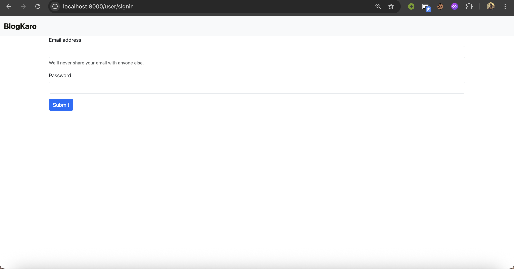
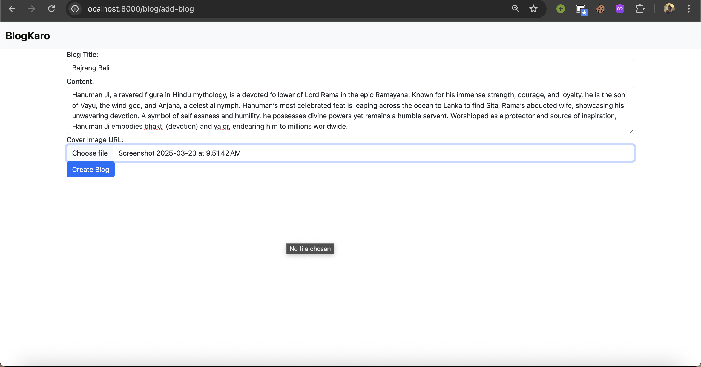

# Blog App

A simple and user-friendly blog application where users can sign up, log in, and create blogs with titles, content, and images. This app provides an intuitive interface for managing personal blogs and sharing ideas.

## Table of Contents
- [Features](#features)
- [Installation](#installation)
- [Usage](#usage)
- [Screenshots](#screenshots)
- [Best Practices](#best-practices)
- [Contributing](#contributing)
- [License](#license)

## Features
- User authentication (Sign Up and Login).
- Create, edit, and delete blog posts.
- Add titles and content to blog posts.
- Upload images to enhance blog posts.
- Responsive design for seamless use on all devices.

## Installation

1. **Clone the Repository**
   ```bash
   git clone https://github.com/shivamxverma/Blog-Writing-Website.git
   cd Blog-Writing-Website
   ```

2. **Install Dependencies**
   Ensure you have [Node.js](https://nodejs.org/) (or your tech stack) installed. Then run:
   ```bash
   npm install
   ```

3. **Set Up Environment Variables**
   Create a `.env` file in the root directory and add the following:
   ```
   MONGO_URL=your_database_url
   PORT=8000
   SECRET_KEY=your_secret_key
   ```
   Replace the placeholders with your actual database URL and secret key.

4. **Run the Application**
   ```bash
   npm run dev
   ```
   The app will be available at `http://localhost:8000`.

## Usage
1. Open your browser and navigate to `http://localhost:8000`.
2. Sign up with a new account or log in with existing credentials.
3. Click on "Create Blog" to start writing a new post.
4. Add a title, content, and upload an image if desired.
5. Save the blog post and view it on the homepage or your profile.

## Screenshots

Here are some screenshots of the Blog App in action. (Add your screenshots below by replacing the placeholders with actual image paths or URLs after uploading them to your repository.)

- **Login Page**  
  

- **Create Blog Post**  
  

